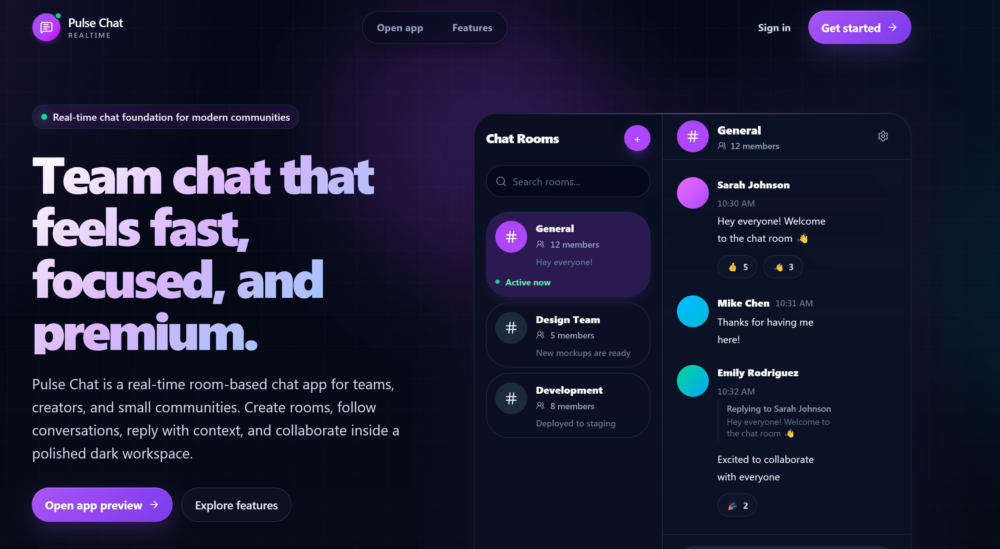
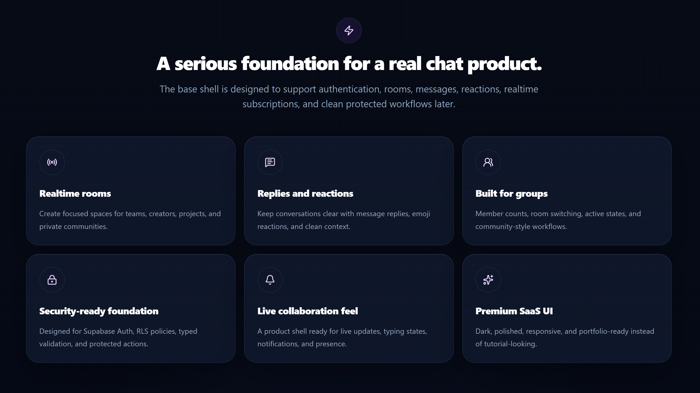
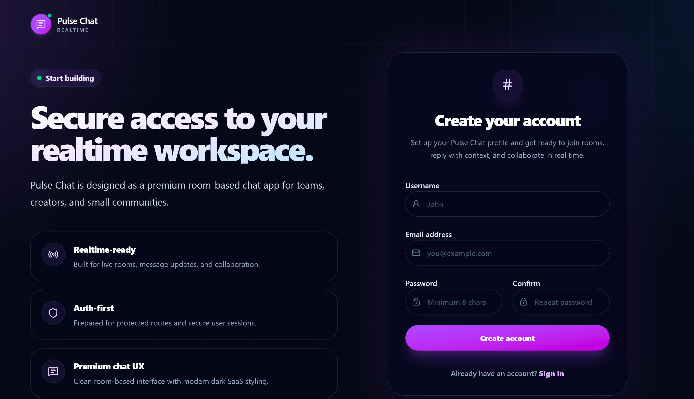
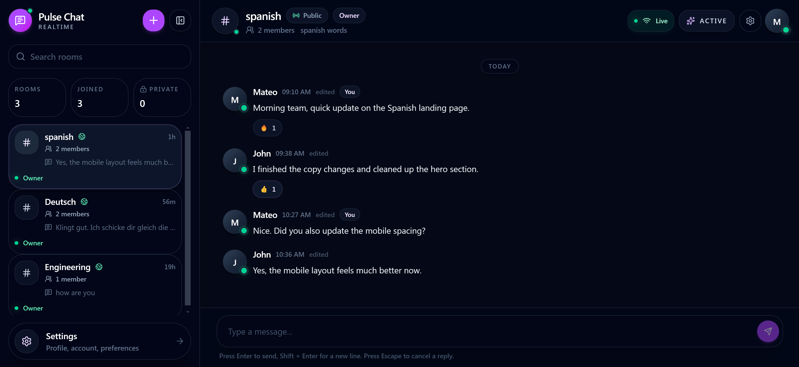
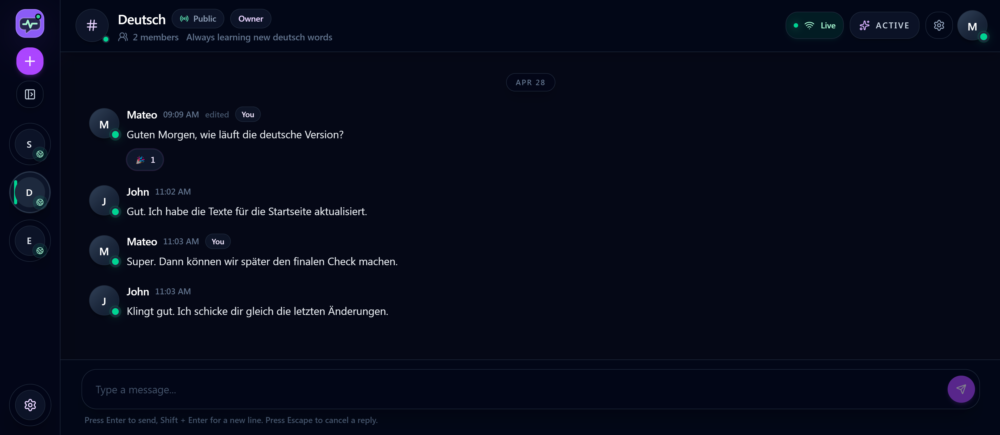
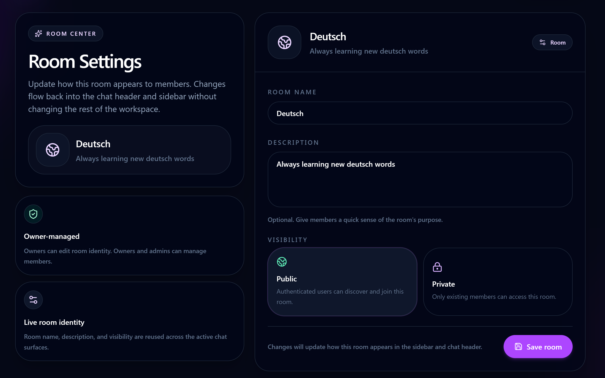

# Pulse Chat

**Pulse Chat** is a production-style realtime team messaging app built with **Next.js 16**, **React 19**, **TypeScript**, **Supabase Auth**, **Supabase Realtime**, **Supabase Postgres**, **Drizzle ORM**, and a polished dark SaaS interface.
It demonstrates authentication, public and private rooms, role-based permissions, private room member management, realtime messaging, replies, emoji reactions, typing indicators, unread counts, message pagination, protected server actions, validation, testing, observability, and production-minded UI/UX.
[Live Demo](https://pulse-chat-skerdid.vercel.app/) | [Repository](https://github.com/skerdiD/pulse_chat) | [Features](#key-features) | [Tech Stack](#tech-stack) | [Getting Started](#getting-started)

---

## Preview

Explore the deployed app: [pulse-chat-skerdid.vercel.app](https://pulse-chat-skerdid.vercel.app/)

### Landing Page



### Authentication

### Chat Workspace


### Room Settings


---

## Overview

Most chat demos stop at a basic message box.
Pulse Chat was built to feel closer to a real SaaS communication product.
The app includes authenticated users, public and private rooms, room membership logic, realtime message delivery, typing indicators, emoji reactions, replies, unread counts, paginated message loading, protected server actions, profile settings, testing, and a responsive premium interface.
The goal was not only to build a working chat app, but to show product thinking, user experience, security, realtime behavior, database modeling, maintainable architecture, and business value.
Pulse Chat is designed around a simple idea: teams and communities need fast conversations, but private access, roles, permissions, and reliable realtime behavior matter just as much as sending messages.

---

## Key Features

### Authentication and Profiles

* Email/password authentication with Supabase Auth
* Protected workspace with server-side session handling
* Automatic user profile sync after authentication
* Profile settings for username and avatar URL updates
* Safer avatar URL validation with fallback behavior
* Avatar fallback with user initials

### Rooms and Permissions

* Create public and private rooms
* Join discoverable public rooms
* Room sidebar with search, active states, and metadata
* Owner/member role support
* Room member tracking through the database
* Owner-only room management actions
* Room-scoped authorization checks
* Archived-room protection logic
* Private room access based on membership

### Private Room Member Management

* Add members to private rooms
* Remove members from private rooms
* Allow members to leave rooms
* Owner/admin style permission checks
* Duplicate membership protection
* Unsafe last-owner removal protection
* Server-side validation for member actions
* Private access controlled through room membership

### Realtime Messaging

* Send and receive messages in realtime
* Supabase Realtime room subscriptions
* Realtime connection status
* Safe subscription cleanup when switching rooms
* Realtime typing indicators and reaction updates
* Stable client-side realtime lifecycle

### Messages and Reactions

* Message author display and timestamps
* Edited message state
* Reply-to-message support
* Reply preview inside the composer
* Message hover actions and copy action
* Emoji reactions with counts and user-aware state

### Pagination and Unread Counts

* Paginated message loading
* Cursor-based older message loading
* Limited default message fetch size
* Per-user unread message counts
* Last-read tracking for room members
* Room list unread indicators

### Security, Testing, and UX

* Server-side authorization checks
* Zod validation for forms and server actions
* Arcjet protection with safer error handling
* Sentry logging support
* Supabase Row Level Security policy support
* Authorization-focused test coverage
* Private room and member permission tests
* Responsive premium dark SaaS interface

---

## Recent Engineering Updates

The latest improvements focused on making Pulse Chat feel more like a production-grade realtime product.

* Added message pagination so rooms do not load every message at once
* Added unread counts using per-user room read state
* Improved avatar URL validation and fallback behavior
* Improved Arcjet protection handling with safer error behavior
* Added stronger authorization/security tests
* Completed private room member management
* Added add/remove/leave room member flows
* Improved private room access protection
* Added safer last-owner/member management rules
* Strengthened archived-room protections

---

## Tech Stack

### Frontend

* Next.js 16 App Router
* React 19
* TypeScript
* Tailwind CSS 4
* shadcn/ui
* Radix UI
* Lucide React
* Sonner
* React Hook Form
* Zod

### Backend and Database

* Next.js Server Actions
* Supabase Auth
* Supabase Postgres
* Supabase Realtime
* Drizzle ORM
* Room membership permissions
* Typed database schema
* Cursor-based message queries
* User-scoped data access

### Security, Observability, and Tooling

* Arcjet
* Supabase Row Level Security
* Sentry
* Vitest
* Playwright
* ESLint
* TypeScript compiler
* Drizzle Kit
* GitHub Actions

---

## Architecture Overview

Pulse Chat uses a modern full-stack architecture built around the Next.js App Router, server actions, Supabase, Drizzle ORM, and Supabase Realtime.

```txt
Client UI
  |-- Next.js App Router
  |-- React Components
  |-- Tailwind CSS / shadcn UI

Auth Layer
  |-- Supabase Authentication
  |-- Protected Routes
  |-- Server-Side Session Handling

Server Layer
  |-- Server Actions
  |-- Zod Validation
  |-- Auth Checks
  |-- Permission Checks
  |-- Arcjet Protection
  |-- Sentry Logging

Database Layer
  |-- Supabase Postgres
  |-- Drizzle ORM
  |-- Profiles / Rooms / Room Members
  |-- Messages / Reactions / Read State

Realtime Layer
  |-- Supabase Realtime
  |-- Message Updates
  |-- Reaction Updates
  |-- Typing Broadcasts
  |-- Room-Scoped Subscriptions

Quality Layer
  |-- ESLint
  |-- TypeScript
  |-- Vitest
  |-- Playwright
  |-- GitHub Actions
```

The app keeps realtime behavior room-scoped, validates user actions on the server, and protects sensitive flows with authorization checks before writing to the database.
Private room access is controlled through room membership, unread counts are based on user-specific room read state, and message pagination keeps the chat experience more scalable as rooms grow.

---

## Product Flow

1. A user signs up or logs in through Supabase Auth.
2. The app creates or syncs the user profile.
3. The user enters the protected chat workspace.
4. The user can create public or private rooms.
5. Users can join available public rooms.
6. Private room owners/admins can add members.
7. Members can access private conversations.
8. Room members can send realtime messages.
9. Users can reply, react, copy messages, and see typing indicators.
10. The app tracks unread messages per user and room.
11. Users can manage profile settings, username, and avatar URL.
12. Server actions validate and protect important mutations.

---

## Getting Started

### 1. Clone the repository

```bash
git clone https://github.com/skerdiD/pulse_chat.git
cd pulse_chat
```

### 2. Install dependencies

```bash
npm install
```

### 3. Create environment variables

Create a `.env.local` file in the root of the project.

```env
NEXT_PUBLIC_SUPABASE_URL=
NEXT_PUBLIC_SUPABASE_PUBLISHABLE_KEY=
DATABASE_URL=
ARCJET_KEY=
NEXT_PUBLIC_SENTRY_DSN=
```

### 4. Push the database schema

```bash
npm run db:push
```

### 5. Apply Supabase RLS policies

Open the Supabase SQL Editor and apply the policies from:

```txt
src/lib/supabase/policies.sql
```

### 6. Start the development server

```bash
npm run dev
```

Open the app at:

```txt
http://localhost:3000
```

---

## Available Scripts

```bash
npm run dev          # Start the development server
npm run build        # Create a production build
npm run start        # Start the production server
npm run lint         # Run ESLint
npm run typecheck    # Run TypeScript checks
npm run test         # Run Vitest unit tests
npm run test:e2e     # Run Playwright E2E tests
npm run test:all     # Run lint, typecheck, unit tests, and E2E tests
npm run db:push      # Push schema changes to the database
npm run db:studio    # Open Drizzle Studio
```

---

## Main Pages

* Landing page for product explanation and CTA
* Authentication pages for signup and login
* Protected chat workspace
* Room conversation page
* Room sidebar with search and metadata
* Room settings and member management
* Profile settings page

---

## Testing and Quality

Pulse Chat includes a practical quality setup designed to catch issues across the main product flow.

* Vitest validates utilities, validators, and server-side logic
* Playwright validates core end-to-end behavior
* TypeScript catches type-level regressions
* ESLint keeps code quality consistent
* Production builds confirm the app can compile successfully
* Authorization tests protect important room and message rules
  Run the full quality suite:

```bash
npm run test:all
```

---

## Business Value

Pulse Chat represents the type of internal communication tool that teams, creators, agencies, students, and online communities often need.
From a business perspective, this project supports faster team communication, private and public collaboration rooms, real-time customer or member support, lightweight internal messaging, creator community management, scalable message loading, and better user engagement through unread counts.
The strongest business value is not only the chat feature itself.
The value is the system behind it: authentication, permissions, realtime updates, member management, unread state, reliable UI, and a structure that can be extended into a real product.

---

## Project Highlights

Pulse Chat demonstrates:

* Production-style realtime chat architecture
* Supabase Auth, Postgres, and Realtime integration
* Drizzle ORM schema modeling
* Room-based authorization and private member management
* Secure server actions
* Message replies, reactions, typing indicators, pagination, and unread counts
* Avatar validation and safe fallbacks
* Arcjet protection and Sentry observability
* Vitest, Playwright, and GitHub Actions
* Polished SaaS-style interface
* Strong foundation for a real collaboration product

---

## Author

Built by **skerdiD**.
GitHub: [@skerdiD](https://github.com/skerdiD)
